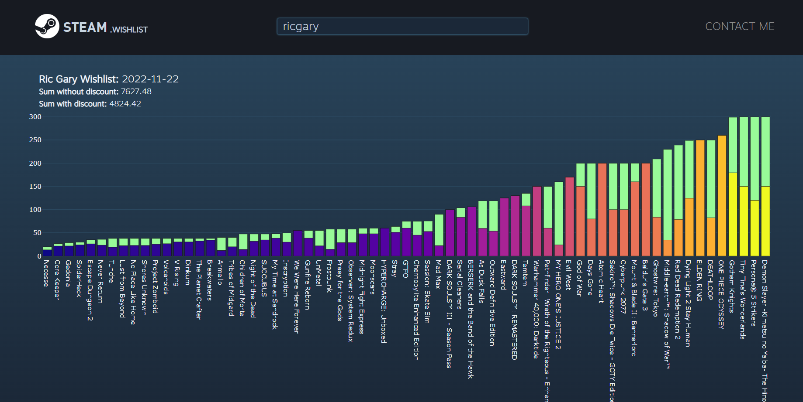

<h1 align="center">My Wishlist Steam!</h1>
<p align="center" >by: <em>Eric Naiber</em></p>

<br>

<p align="center" >
    
</p>

<p align="center" ><b>Game:</b> Tiny Thor Kraken</p>

<hr>

<h2>
    <b>How it works?</b>
</h2>

It's basically web scraping on the url of your steam wishlist. With that in mind, the code will only run if your account is set to public.

<p align="center" >
    
</p>

<hr>

<h2>
    <b>Installation:</b>
</h2>

<br>

* Clone the repository:

    ```
    git clone https://github.com/RicGary/My-Wishlist-Steam.git
    ```

* Install requirements:

    ```
    pip install -r [PATH]/requirements.
    ```

* Run the application

    ```
    python [PATH]/app.py
    ```

<hr>

<h2>
    <b>Next Steps:</b>
</h2>

I'm thinking about putting it online, with its own IP and name. Also I'm aiming to make a search engine inside it to compare where you are going to pay for the smallest amount among the famous gaming platforms, such as: Steam, Epic Games, Origin, etc.

<br>

<h3>
    Thanks for the attention, feel free to comment or contact me!
</h3>